# Repository Documentation

> Auto-generated by Operon on 2026-02-27 17:25


## Project Overview

```json
{
  "project_description": "Operon is an advanced AI software project designed to manage and automate file modifications with safety and precision. It includes components for approval, decision-making, and interaction with large language models (LLMs).",
  "main_components": {
    "agent/approval.py": "Handles the approval process for file mutations, ensuring that changes are validated, logged, and timeout-safe. It prevents empty diffs and shows meaningful content for large files.",
    "agent/decide.py": "Deterministic-first decision-making process that reads the current file content from disk, checks for changes, and calls the LLM for goal-satisfaction checks. It provides full file previews for verbatim SEARCH block copying.",
    "agent/llm.py": "Manages interactions with various LLMs, including local, OpenAI, Anthropic, and others. It ensures that file content is never trimmed when passed for editing, addressing a key fix from version 3.1."
  }
}
```


## Module Index

| Module | Summary |
|--------|---------|
| [`agent/__init__.py`](modules/agent___init__.md) | (empty) |
| [`agent/approval.py`](modules/agent_approval.md) | ask_user_approval |
| [`agent/decide.py`](modules/agent_decide.md) | _read_disk, _reviewer_deterministic, decide_next_action |
| [`agent/llm.py`](modules/agent_llm.md) | _cfg_path, _load_config, save_config, _strip_fences, extract_json |
| [`agent/logger.py`](modules/agent_logger.md) | TUILogHandler, _safe_ui_callback, setup_logger, emit |
| [`agent/loop.py`](modules/agent_loop.md) | _ensure, _norm, _canon, _is_noop_action, _approve |
| [`agent/planner.py`](modules/agent_planner.md) | make_plan |
| [`agent/repo.py`](modules/agent_repo.md) | build_repo_summary |
| [`agent/tool_jail.py`](modules/agent_tool_jail.md) | validate_tool |
| [`agent/validators.py`](modules/agent_validators.md) | _removed, _added, validate_step |
| [`cli/__init__.py`](modules/cli___init__.md) | (empty) |
| [`cli/explain.py`](modules/cli_explain.md) | _find_repo_root, _get_llm, _get_graph, cmd_explain, _explain_symbol |
| [`main.py`](modules/main.md) | _is_cli_command |
| [`print.java`](modules/print.java) | (empty) |
| [`print.js`](modules/print.js) | (empty) |
| [`runtime/state.py`](modules/runtime_state.md) | AgentState |
| [`tools/__init__.py`](modules/tools___init__.md) | (empty) |
| [`tools/ast_engine.py`](modules/tools_ast_engine.md) | Edit, RenameResult, UsageEntry, _list_py_files, _list_code_files, _read, _lines, |
| [`tools/build_brain.py`](modules/tools_build_brain.md) | (empty) |
| [`tools/chunked_loader.py`](modules/tools_chunked_loader.md) | Chunk, _tokenize_query, _score_chunk, _extract_py_chunks, _extract_regex_chunks, |
| [`tools/code_slice.py`](modules/tools_code_slice.md) | load_function_slice |
| [`tools/diff_engine.py`](modules/tools_diff_engine.md) | parse_search_replace, _norm, _find_block, _reindent, apply_patch |
| [`tools/diff_report.py`](modules/tools_diff_report.md) | dump_diff_report_from_json, dump_diff_report_from_repo |
| [`tools/doc_generator.py`](modules/tools_doc_generator.md) | _read, _write_doc, _safe_module_name, _function_signature, _class_signature |
| [`tools/fs_tools.py`](modules/tools_fs_tools.md) | read_file, write_file |
| [`tools/function_locator.py`](modules/tools_function_locator.md) | find_function |
| [`tools/git_safety.py`](modules/tools_git_safety.md) | run_git, _is_git_repo, setup_git_env, rollback_files, commit_success |
| [`tools/path_resolver.py`](modules/tools_path_resolver.md) | _all_files, resolve_path, read_resolved |
| [`tools/repo_brain.py`](modules/tools_repo_brain.md) | build_tree, extract_imports_regex, build_repo_brain |
| [`tools/repo_index.py`](modules/tools_repo_index.md) | list_repo_files, _file_hash, _build_symbol_index_for_file, _extract_raw_imports, |
| [`tools/repo_search.py`](modules/tools_repo_search.md) | search_repo |
| [`tools/semantic_memory.py`](modules/tools_semantic_memory.md) | get_db_path, _hash_file, index_repo, search_memory |
| [`tools/symbol_graph.py`](modules/tools_symbol_graph.md) | _list_code_files, _file_hash, _build_py_usages, _build_regex_usages, _graph_path |
| [`tools/universal_parser.py`](modules/tools_universal_parser.md) | check_syntax, _ast_extract_python, _extract_comments_python, _regex_extract_js,  |
| [`tui/__init__.py`](modules/tui___init__.md) | (empty) |
| [`tui/app.py`](modules/tui_app.md) | LLMSettingsPanel, DiffApproval, OperonUI, compose, on_mount, _load_current, _upd |

## Dependency Graph

```mermaid
graph TD
  agent_approval_py --> __future__
  agent_approval_py --> agent_logger
  agent_decide_py --> __future__
  agent_decide_py --> pathlib
  agent_decide_py --> agent_llm
  agent_llm_py --> __future__
  agent_llm_py --> pathlib
  agent_llm_py --> typing
  agent_loop_py --> __future__
  agent_loop_py --> pathlib
  agent_loop_py --> typing
  agent_planner_py --> __future__
  agent_planner_py --> agent_llm
  agent_planner_py --> agent_logger
  agent_repo_py --> pathlib
  agent_validators_py --> __future__
  agent_validators_py --> typing
  cli_explain_py --> __future__
  cli_explain_py --> pathlib
  cli_explain_py --> typing
  main_py --> cli_explain
  main_py --> tui_app
  runtime_state_py --> dataclasses
  runtime_state_py --> dataclasses
  runtime_state_py --> typing
  tools_ast_engine_py --> __future__
  tools_ast_engine_py --> dataclasses
  tools_ast_engine_py --> dataclasses
  tools_build_brain_py --> tools_repo_brain
  tools_build_brain_py --> agent_llm
  tools_chunked_loader_py --> __future__
  tools_chunked_loader_py --> dataclasses
  tools_chunked_loader_py --> pathlib
  tools_code_slice_py --> pathlib
  tools_code_slice_py --> tools_function_locator
  tools_diff_engine_py --> __future__
  tools_diff_engine_py --> typing
  tools_diff_engine_py --> typing
  tools_diff_report_py --> pathlib
  tools_doc_generator_py --> __future__
  tools_doc_generator_py --> pathlib
  tools_doc_generator_py --> typing
  tools_fs_tools_py --> pathlib
  tools_fs_tools_py --> typing
  tools_function_locator_py --> pathlib
  tools_function_locator_py --> tools_universal_parser
  tools_git_safety_py --> pathlib
  tools_git_safety_py --> agent_logger
```


