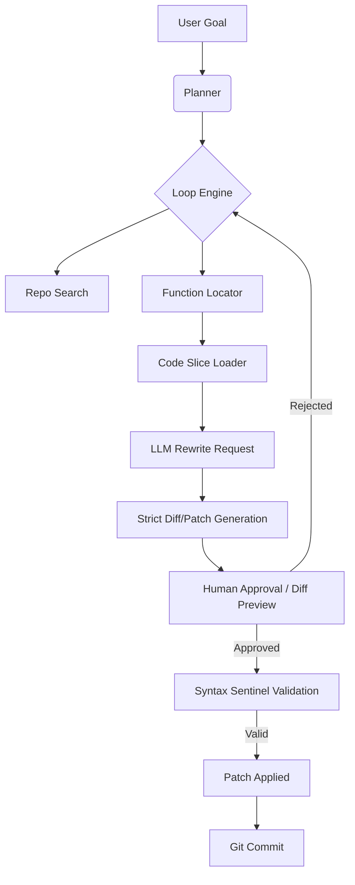

# 🧬 Operon

> Operon is a local-first autonomous coding agent that surgically modifies repository functions using deterministic loop control, slice-based rewriting, and human-approved commits.

Operon is not a chatbot, a script runner, or a blind patch generator. It is designed to act as a deterministic, controllable, and auditable autonomous software engineer living directly inside your terminal.

---

## ⚡ Core Philosophy

Operon is built strictly around five non-negotiable principles:

1. **Local-First:** Runs entirely on your machine. No API dependencies, zero privacy leaks, full control over your repository.
2. **Surgical Edits Only:** Operon will never blindly rewrite entire files. It detects functions, extracts code slices, modifies them, and patches the exact slice back into the file.
3. **Deterministic Execution Loop:** The LLM is the brain, but Operon's engine is the surgeon. The loop engine controls reality; the LLM only suggests actions.
4. **Human Approval Gates:** Destructive actions (rewriting functions, running shell commands, committing code) require explicit user approval (`y/n`) alongside interactive syntax diff previews to prevent repo-nuking.
5. **Tool-Based Architecture:** The LLM never touches the filesystem directly. Everything routes through explicit, sandboxed tools (`read_file`, `rewrite_function`, `search_repo`).

---

## 🏗️ Architecture & Pipeline

Operon utilizes a ReAct (Reasoning + Acting) loop combined with a surgical code parser. 

📁 Repository Structure
The Engine (/agent/)
 * loop.py: 🔥 The Heart. The main execution engine. It controls reading files, triggering rewrites, managing the ReAct decision loop, handling approval flows, and enforcing anti-hallucination safeguards.
 * planner.py: Translates the user goal into high-level steps. Provides guidance, but the Loop Engine remains in control.
 * decide.py: The fallback decision system. When the next action isn't strictly programmatic, it asks the LLM: "What tool should we use next?"
 * approval.py: The human-in-the-loop gatekeeper. Stops the agent from executing dangerous operations without confirmation.
 * llm.py: The thin wrapper around your local model (e.g., llama.cpp / Qwen / Llama 3). It handles prompt formatting and JSON parsing. No core agent logic lives here.
 * logger.py: Handles detailed, colorized terminal output and session logging.
The Hands (/tools/)
 * fs_tools.py: Safe filesystem operations (read_file, write_file).
 * repo_search.py: Greps the repository for keywords and file hits to build context.
 * function_locator.py: Parses AST to find the exact file and line numbers of specific functions.
 * code_slice.py: Extracts the exact block of code for a function, allowing for surgical, context-aware edits.
 * diff_engine.py: Parses <<<<<<< SEARCH / ======= / >>>>>>> REPLACE blocks generated by the LLM and strictly applies them to the file.
 * git_tools.py: Automatically handles git add, git commit, and staging after successful, syntax-validated rewrites.
The Memory (/runtime/)
 * state.py: Tracks the current AgentState, including the goal, files read, files modified, step count, observations, error logs, and episodic memory.
🔧 How rewrite_function Actually Works
Operon does not trust the LLM to write full files. It forces the LLM to act as a diff tool.
 * Locate: Operon detects the target file/function.
 * Read: Operon loads the specific file into the LLM's context.
 * Prompt: The LLM is instructed to output exact SEARCH and REPLACE blocks.
 * Parse: Operon parses the blocks, stripping markdown fences.
 * Preview: Operon prints a clear CHANGE: [Old] → [New] preview in the terminal.
 * Approve: The user must explicitly type y to approve the specific change.
 * Match: Operon attempts a strict character-for-character match of the SEARCH block.
 * Fallback: If strict matching fails due to LLM spacing quirks, Operon falls back to a Whitespace-Normalized Regex Matcher.
 * Validate: Operon runs the patched file through an AST SyntaxError sentinel. If the syntax is invalid, the patch is rolled back immediately.
 * Apply: The file is saved.
🛡️ Safeguards & Anti-Hallucination
Operon is built to handle the chaotic nature of smaller, local LLMs (7B-14B parameters):
 * Premature Finish Blocker: If the agent tries to call finish without modifying any files, Operon physically intercepts the command and forces it to continue.
 * Multi-File Safeguard: If the agent reads 3 files but only patches 1, Operon intercepts the finish command and reminds the agent of the unpatched files.
 * Infinite Loop Breaker: If the agent attempts to execute the exact same tool payload twice in a row, Operon blocks it, injects an error into the context, and forces the agent to try a different approach.
 * Syntax Sentinel: Code is parsed via ast.parse() before writing to disk. Broken Python code is instantly rejected.
🚀 Future Roadmap
 * Phase 1 (Current): File reading, function detection, strict SEARCH/REPLACE block patching, syntax validation, multi-tasking, human approval.
 * Phase 2 (Next): Full multi-file reasoning (e.g., editing a function in A.py, updating the import in B.py, and modifying the helper in C.py in a single cohesive plan).
 * Phase 3: Autonomous debugging loop (modify → run test suite → if fail → read stdout → retry patch).
 * Phase 4: Full Claude-Code/Devin style autonomous operation without hand-holding.
Built for local, deterministic, and safe autonomous development.

